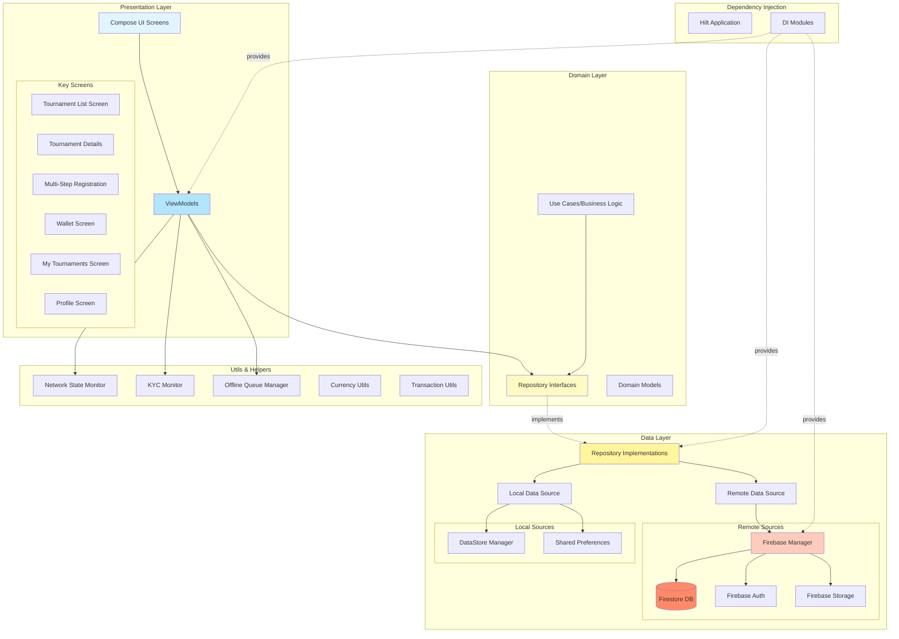
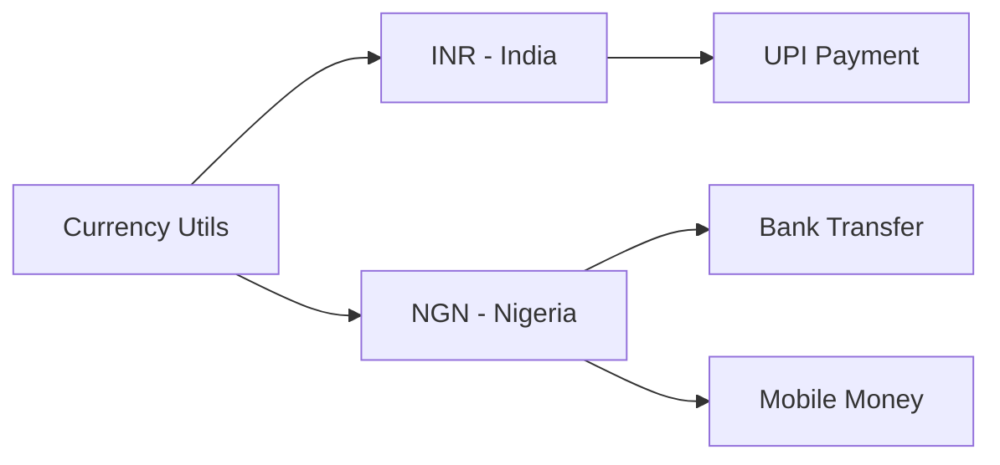
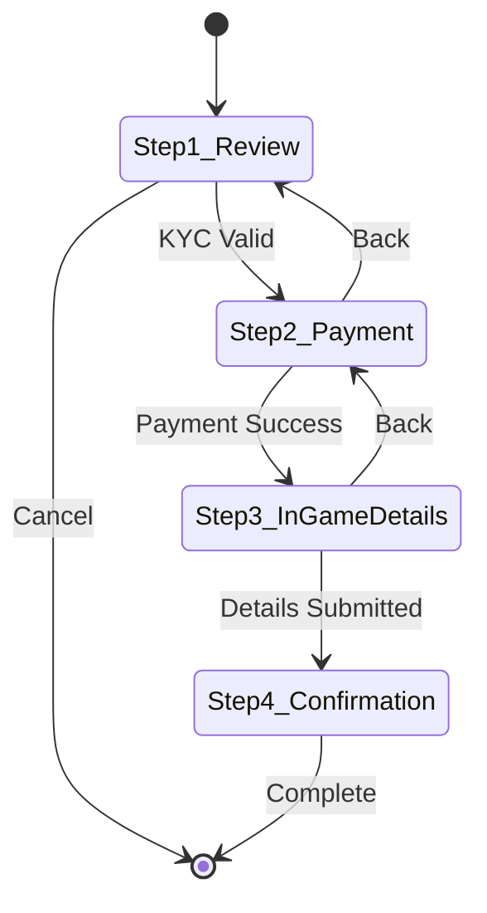
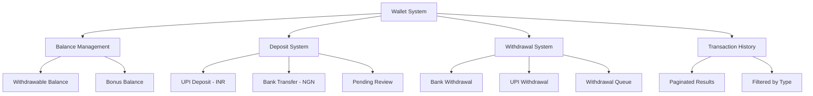
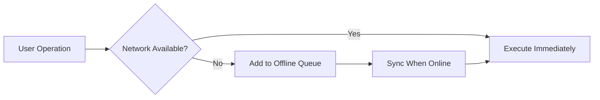
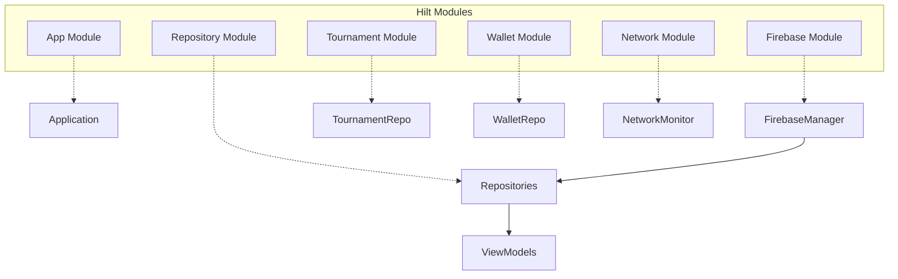
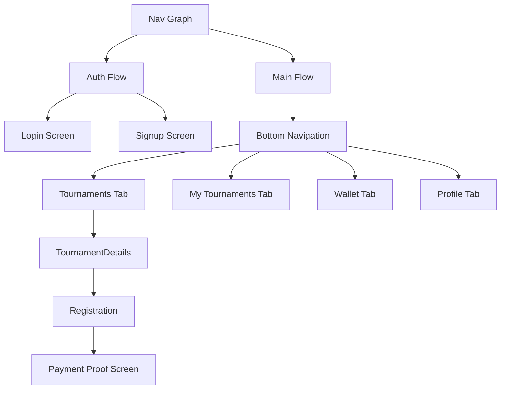
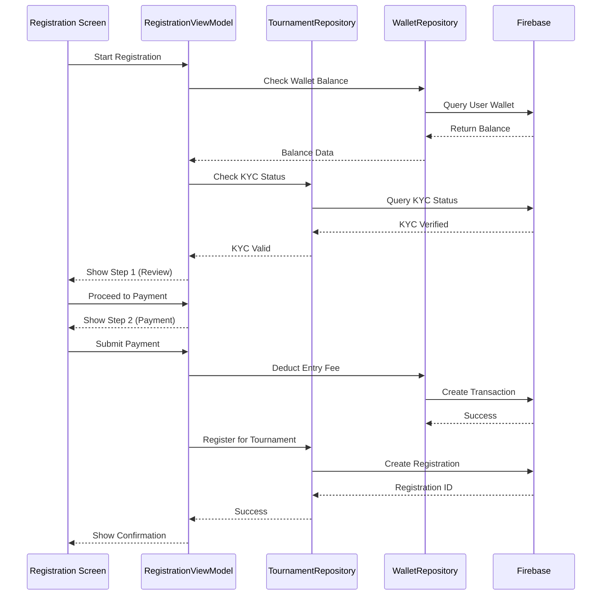

# NetWin Android - Architecture Documentation

## Overview
NetWin is a PUBG/BGMI tournament application built using **Clean Architecture** principles with **MVVM** pattern, ensuring separation of concerns, testability, and maintainability.

## Tech Stack
- **Language**: Kotlin
- **UI**: Jetpack Compose + Material 3
- **Dependency Injection**: Hilt (Dagger)
- **Backend**: Firebase (Firestore, Auth, Storage)
- **Navigation**: Jetpack Navigation Compose
- **Async**: Kotlin Coroutines + Flow
- **Image Loading**: Coil
- **Pagination**: Paging 3

---

## Architecture Diagram



---

## Layer Details

### 1. Presentation Layer
**Location**: `app/src/main/java/com/cehpoint/netwin/presentation/`

#### ViewModels
- **TournamentViewModel**: Tournament list, filters, pagination
- **WalletViewModel**: Wallet operations, deposits, withdrawals, transactions
- **UserViewModel**: User profile, authentication, KYC
- **RegistrationViewModel**: Multi-step tournament registration flow

#### UI Screens
- **TournamentListScreen**: Browse tournaments with filters and pagination
- **TournamentDetailsScreen**: View tournament details and rules
- **MultiStepRegistrationScreen**: 4-step registration process
  1. Tournament Review & KYC Check
  2. Payment
  3. In-Game Details
  4. Confirmation
- **WalletScreen**: Wallet management, deposits, withdrawals
- **MyTournamentsScreen**: User's registered tournaments with room credentials
- **ProfileScreen**: User profile and settings

### 2. Domain Layer
**Location**: `app/src/main/java/com/cehpoint/netwin/domain/`

#### Repository Interfaces
```kotlin
interface TournamentRepository
interface WalletRepository
interface UserRepository
```

#### Key Domain Models
- **Tournament**: Tournament data model
- **User**: User profile model
- **Transaction**: Financial transaction model
- **PendingDeposit**: Pending deposit request
- **WithdrawalRequest**: Withdrawal request model
- **KycStatus**: KYC verification status

### 3. Data Layer
**Location**: `app/src/main/java/com/cehpoint/netwin/data/`

#### Repository Implementations
- **TournamentRepositoryImpl**: Firebase-based tournament operations
- **WalletRepositoryImpl**: Wallet and transaction operations
- **UserRepositoryImpl**: User management and authentication

#### Firebase Collections
```
Firestore Structure:
├── users/
│   ├── {userId}/
│   │   ├── profile data
│   │   ├── kycStatus
│   │   └── wallet balance
├── tournaments/
│   ├── {tournamentId}/
│   │   ├── details
│   │   ├── rules
│   │   └── registrations/
├── transactions/
│   ├── {transactionId}/
│   │   ├── type (DEPOSIT/WITHDRAWAL)
│   │   ├── amount
│   │   ├── status
│   │   └── timestamp
├── pendingDeposits/
└── withdrawalRequests/
```

---

## Key Features Architecture

### Multi-Currency Support


**Supported Currencies**:
- **INR** (India): UPI payments
- **NGN** (Nigeria): Bank transfer, Mobile money, Card payments

### Multi-Step Registration Flow


**Steps**:
1. **Tournament Review & KYC**: Verify user eligibility and KYC status
2. **Payment**: Handle entry fee payment (multi-currency)
3. **In-Game Details**: Collect PUBG/BGMI player details
4. **Confirmation**: Show registration summary

### Wallet System


**Features**:
- Dual balance system (Withdrawable + Bonus)
- Multi-currency deposit/withdrawal
- UPI app relaunch for screenshot proof
- Offline queue for failed operations
- Transaction history with pagination

### Offline Support


**Components**:
- **NetworkStateMonitor**: Real-time network status
- **OfflineQueueManager**: Queue operations for retry
- Automatic sync when connection restored

---

## Dependency Injection Structure



**Key Modules**:
- **AppModule**: Application-level dependencies
- **FirebaseModule**: Firebase SDK configuration
- **RepositoryModule**: Base repository bindings
- **WalletModule**: Wallet-specific dependencies
- **TournamentModule**: Tournament-specific dependencies
- **NetworkModule**: Network monitoring utilities

---

## Navigation Structure



**Bottom Navigation** (4 tabs):
1. **Tournaments**: Browse and search tournaments
2. **My Tournaments**: Registered tournaments + room credentials
3. **Wallet**: Wallet management
4. **Profile**: User settings and KYC

---

## Data Flow Example: Tournament Registration



---

## Testing Strategy

### Unit Tests
- ViewModels business logic
- Repository implementations
- Utility functions (Currency, Transaction)

### Integration Tests
- Firebase operations
- Multi-step registration flow
- Wallet transactions

### UI Tests
- Screen navigation
- Form validation
- Multi-step flows

---

## Performance Optimizations

1. **Pagination**: Paging 3 for large lists (tournaments, transactions)
2. **Lazy Loading**: Images loaded with Coil + caching
3. **State Management**: Immutable states with sealed classes
4. **Flow Optimization**: Cold flows for one-time operations, hot flows for real-time updates
5. **Compose Optimization**: Remember, derivedStateOf for expensive calculations

---

## Security Considerations

1. **Firebase Security Rules**: Server-side validation
2. **KYC Verification**: Required before withdrawals
3. **Transaction Verification**: Admin approval for deposits/withdrawals
4. **Secure Storage**: Sensitive data in encrypted DataStore
5. **API Keys**: Not hardcoded, stored securely

---

## Future Enhancements

1. **Push Notifications**: Firebase Cloud Messaging
2. **Analytics**: Firebase Analytics integration
3. **Crashlytics**: Error monitoring
4. **Remote Config**: Feature flags
5. **Performance Monitoring**: Firebase Performance
6. **In-App Updates**: Play Core library
7. **Biometric Auth**: Fingerprint/Face authentication

---

## Project Structure

```
app/
├── src/main/java/com/cehpoint/netwin/
│   ├── data/
│   │   ├── local/
│   │   │   └── DataStoreManager.kt
│   │   ├── model/
│   │   │   ├── Tournament.kt
│   │   │   ├── Transaction.kt
│   │   │   ├── User.kt
│   │   │   └── ...
│   │   ├── remote/
│   │   │   └── FirebaseManager.kt
│   │   └── repository/
│   │       ├── TournamentRepositoryImpl.kt
│   │       ├── WalletRepositoryImpl.kt
│   │       └── UserRepositoryImpl.kt
│   ├── domain/
│   │   └── repository/
│   │       ├── TournamentRepository.kt
│   │       ├── WalletRepository.kt
│   │       └── UserRepository.kt
│   ├── presentation/
│   │   ├── screens/
│   │   │   ├── tournament/
│   │   │   ├── wallet/
│   │   │   ├── profile/
│   │   │   └── registration/
│   │   └── viewmodels/
│   │       ├── TournamentViewModel.kt
│   │       ├── WalletViewModel.kt
│   │       └── UserViewModel.kt
│   ├── di/
│   │   ├── AppModule.kt
│   │   ├── FirebaseModule.kt
│   │   ├── RepositoryModule.kt
│   │   ├── TournamentModule.kt
│   │   └── WalletModule.kt
│   ├── navigation/
│   │   ├── NavGraph.kt
│   │   └── NavigationRoutes.kt
│   └── utils/
│       ├── NetworkStateMonitor.kt
│       ├── KYCMonitor.kt
│       ├── OfflineQueueManager.kt
│       ├── CurrencyUtils.kt
│       └── TransactionUtils.kt
```

---

## Design Patterns Used

1. **MVVM**: Separation of UI and business logic
2. **Repository Pattern**: Abstract data sources
3. **Dependency Injection**: Hilt for loose coupling
4. **Observer Pattern**: Kotlin Flows for reactive data
5. **Factory Pattern**: ViewModelFactory with Hilt
6. **Singleton Pattern**: Firebase manager, network monitor
7. **State Pattern**: Sealed classes for UI states
8. **Strategy Pattern**: Different payment methods per currency

---

## Key Decisions & Rationale

### Why Clean Architecture?
- **Separation of Concerns**: Each layer has a single responsibility
- **Testability**: Easy to unit test each layer independently
- **Maintainability**: Changes in one layer don't affect others
- **Scalability**: Easy to add new features

### Why Jetpack Compose?
- **Modern UI**: Declarative UI paradigm
- **Less Boilerplate**: No XML layouts
- **Type Safety**: Compile-time UI checks
- **Better Performance**: Smart recomposition

### Why Firebase?
- **Real-time Data**: Instant updates across devices
- **Scalability**: Managed infrastructure
- **Cost-Effective**: Pay-as-you-go pricing
- **Rich Features**: Auth, DB, Storage, Analytics in one platform

---

## Contact & Support
For questions or contributions, please refer to the project repository.

---

**Last Updated**: October 2025
**Version**: 1.0.0
